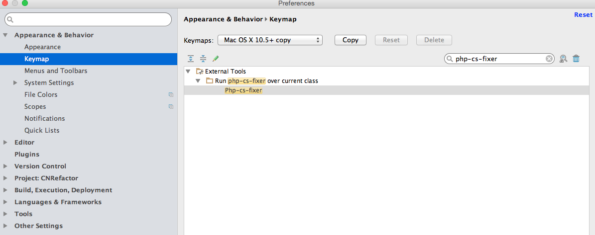

#PHP-CS-Fixer代码格式化工具安装方法


###PhpStorm安装方法

####Step 1: 下载并安装工具
```sh
sudo curl -L http://cs.sensiolabs.org/download/php-cs-fixer-v2.phar -o /usr/local/bin/php-cs-fixer
sudo curl -L https://github.com/FriendsOfPHP/PHP-CS-Fixer/releases/download/v2.1.1/php-cs-fixer.phar -o /usr/local/bin/php-cs-fixer
#or
sudo wget http://cs.sensiolabs.org/download/php-cs-fixer-v2.phar -O /usr/local/bin/php-cs-fixer
sudo wget https://github.com/FriendsOfPHP/PHP-CS-Fixer/releases/download/v2.1.1/php-cs-fixer.phar -O /usr/local/bin/php-cs-fixer

sudo chmod a+x /usr/local/bin/php-cs-fixer
#update
sudo /usr/local/php/bin/php /usr/local/bin/php-cs-fixer selfupdate

```

####Step 2: 打开设置
打开设置Settings/Preferences. 导航找到：Tools -> External Tools并用下图的值填充。


由于版本升级，所以要使用如下命令查看参数配置是否可用，否则是运行不成功的。
```sh
#查看使用方法
sudo /usr/local/php/bin/php /usr/local/bin/php-cs-fixer --help
```
Name:`Php-cs-fixer`
Group:`php-cs-fixer over current class`
Description:`Command with --dry-run and --diff`
Program:`/usr/local/php/bin/php`
Parameters:`/usr/local/bin/php-cs-fixer --quiet --verbose fix "$FileDir$/$FileName$"`
Working directory:`$ProjectFileDir$`

####Step 3: 设置快捷键
再次导航到：`Settings/Preferences` 找到`Keymap`项，搜索`php-cs-fixer`,找到后右键添加快捷键。



###Step 4: 添加通用配置
在每个开发项目下添加一个名为`.php_cs`的配置文件，内容如下，可自行调整
```php
<?php
$header = <<<'EOF'
This file is part of PHP CS Fixer.
(c) php-team@yaochufa <php-team@yaochufa.com>
This source file is subject to the MIT license that is bundled
with this source code in the file LICENSE.
EOF;
return PhpCsFixer\Config::create()
    ->setRiskyAllowed(true)
    ->setRules([
        '@Symfony' => true,
        '@Symfony:risky' => true,
        'array_syntax' => ['syntax' => 'short'],
        'combine_consecutive_unsets' => true,
        // one should use PHPUnit methods to set up expected exception instead of annotations
        'general_phpdoc_annotation_remove' => ['expectedException', 'expectedExceptionMessage', 'expectedExceptionMessageRegExp'],
        'header_comment' => array('header' => $header),
        'heredoc_to_nowdoc' => true,
        'no_extra_consecutive_blank_lines' => ['break', 'continue', 'extra', 'return', 'throw', 'use', 'parenthesis_brace_block', 'square_brace_block', 'curly_brace_block'],
        'no_unreachable_default_argument_value' => true,
        'no_useless_else' => true,
        'no_useless_return' => true,
        'ordered_class_elements' => true,
        'ordered_imports' => true,
        'php_unit_strict' => true,
        'phpdoc_add_missing_param_annotation' => true,
        'phpdoc_order' => true,
        'psr4' => true,
        'strict_comparison' => false,
        'strict_param' => false, //这里设置为true，发现in_array方法会默认加上第3个参数为true，这使得in_array会对前两个参数值的类型也会做严格的校验，建议设置为false
        'binary_operator_spaces' => ['align_double_arrow' => true, 'align_equals' => true],
        'concat_space' => ['spacing' => 'one'],
        'no_empty_statement' => true,
        'simplified_null_return' => true,
        'no_extra_consecutive_blank_lines' => true,
        'pre_increment' => false, //设置为false，$i++ 不会变成 ++$i
    ])
    ->setFinder(
        PhpCsFixer\Finder::create()
            ->exclude('vendor')
            ->in(__DIR__)
    )
    ->setUsingCache(false)
;
```

###Sublime Text安装方法

http://www.uedbox.com/macos-install-sublime-phpcs/