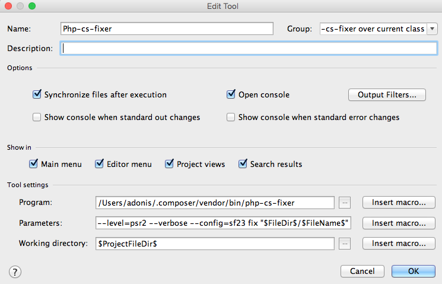

#PHP-CS-Fixer代码格式化工具安装方法


###PhpStorm安装方法

####Step 1: 下载并安装工具
```sh
sudo curl -L https://github.com/FriendsOfPHP/PHP-CS-Fixer/releases/download/v1.12.3/php-cs-fixer.phar -o /usr/local/bin/php-cs-fixer
#or
sudo wget https://github.com/FriendsOfPHP/PHP-CS-Fixer/releases/download/v1.12.3/php-cs-fixer.phar -O /usr/local/bin/php-cs-fixer

sudo chmod a+x /usr/local/bin/php-cs-fixer
#update
sudo /usr/local/php/bin/php /usr/local/bin/php-cs-fixer selfupdate

```

####Step 2: 打开设置
打开设置Settings/Preferences. 导航找到：Tools -> External Tools并用下图的值填充。



由于版本升级，所以要使用如下命令查看参数配置是否可用，否则是运行不成功的。
```sh
#查看使用方法
sudo /usr/local/php/bin/php /usr/local/bin/php-cs-fixer --help
```
Name:`Php-cs-fixer`
Group:`php-cs-fixer over current class`
Description:`Command with --dry-run and --diff`
Program:`/usr/local/bin/php-cs-fixer`
Parameters:`--quiet --verbose fix "$FileDir$/$FileName$"`
Working directory:`$ProjectFileDir$`

####Step 3: 设置快捷键
再次导航到：`Settings/Preferences` 找到`Keymap`项，搜索`php-cs-fixer`,找到后右键添加快捷键。


###Sublime Text安装方法

http://www.uedbox.com/macos-install-sublime-phpcs/