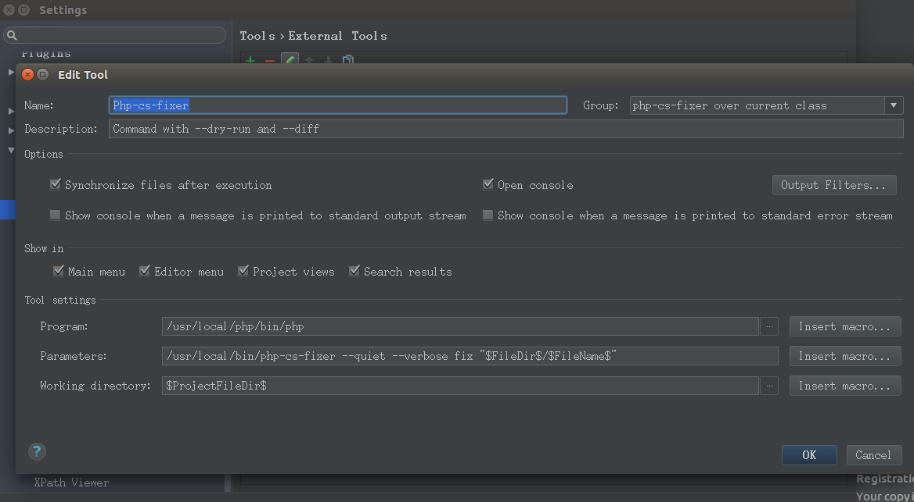
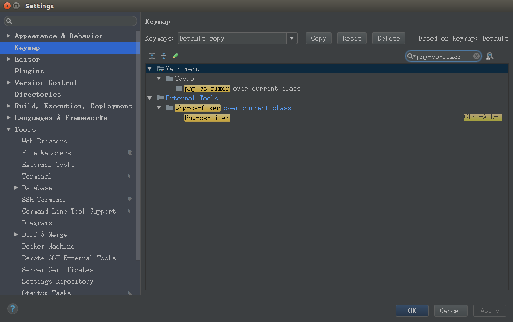
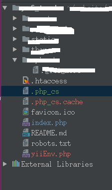

#PHP-CS-Fixer V2版本代码格式化工具安装方法

##命令行使用方式
```sh
sudo curl -L https://github.com/FriendsOfPHP/PHP-CS-Fixer/releases/download/v2.3.1/php-cs-fixer.phar -o /usr/local/bin/php-cs-fixer
sudo chmod a+x /usr/local/bin/php-cs-fixer
#update
sudo /usr/local/php/bin/php /usr/local/bin/php-cs-fixer selfupdate

sudo /usr/local/php/bin/php /usr/local/bin/php-cs-fixer fix ~/website/ycf_trade/ --config="/home/qianxun/.php_cs" --dry-run

```


##PhpStorm安装方法
github地址：https://github.com/FriendsOfPHP/PHP-CS-Fixer

####Step 1: 下载并安装工具
```sh
sudo curl -L http://cs.sensiolabs.org/download/php-cs-fixer-v2.phar -o /usr/local/bin/php-cs-fixer
sudo curl -L https://github.com/FriendsOfPHP/PHP-CS-Fixer/releases/download/v2.3.1/php-cs-fixer.phar -o /usr/local/bin/php-cs-fixer
#or
sudo wget http://cs.sensiolabs.org/download/php-cs-fixer-v2.phar -O /usr/local/bin/php-cs-fixer
sudo wget https://github.com/FriendsOfPHP/PHP-CS-Fixer/releases/download/v2.3.1/php-cs-fixer.phar -O /usr/local/bin/php-cs-fixer

sudo chmod a+x /usr/local/bin/php-cs-fixer
#update
sudo /usr/local/php/bin/php /usr/local/bin/php-cs-fixer selfupdate

```

####Step 2: 打开设置
打开设置Settings/Preferences. 导航找到：Tools -> External Tools并用下图的值填充。



由于版本升级，所以要使用如下命令查看参数配置是否可用，否则是运行不成功的。
```sh
#查看使用方法
sudo /usr/local/php/bin/php /usr/local/bin/php-cs-fixer --help
```

LINUX:
>Name:`Php-cs-fixer`   <br>
>Group:`php-cs-fixer over current class`   <br>
>Description:`Command with --dry-run and --diff`   <br>
>Program:`/usr/local/php/bin/php`   <br>
>Parameters:`/usr/local/bin/php-cs-fixer --quiet --verbose --config=/home/qianxun/website/lnmp/.php_cs fix "$FileDir$/$FileName$"`   <br>
>--quiet参数表示不输出
>Working directory:`$ProjectFileDir$`   <br>

WINDOWS:
>Name:`Php-cs-fixer`   <br>
>Group:`php-cs-fixer over current class`   <br>
>Description:`Command with --dry-run and --diff`   <br>
>Program:`D:\php-7.1.5-Win32-VC14-x64\php.exe`   <br>
>Parameters:`D:\php-cs-fixer\php-cs-fixer.phar --quiet --verbose --config=D:\website\lnmp\.php_cs fix "$FileDir$\$FileName$"`   <br>
>--quiet参数表示不输出
>Working directory:`$ProjectFileDir$`   <br>

####Step 3: 设置快捷键
再次导航到：`Settings/Preferences` 找到`Keymap`项，搜索`php-cs-fixer`,找到后右键添加快捷键。



###Step 4: 添加通用配置



在每个开发项目根目录下创建一个名为`.php_cs`的配置文件，内容如下，可自行调整
```php
<?php
$header = <<<'EOF'
This file is part of PHP CS Fixer.
(c) php-team@yaochufa <php-team@yaochufa.com>
This source file is subject to the MIT license that is bundled
with this source code in the file LICENSE.
EOF;
return PhpCsFixer\Config::create()
    ->setRiskyAllowed(true)
    ->setRules([
        '@Symfony' => true,
        '@Symfony:risky' => true,
        'array_syntax' => ['syntax' => 'short'],
        'combine_consecutive_unsets' => true,
        // one should use PHPUnit methods to set up expected exception instead of annotations
        'general_phpdoc_annotation_remove' => ['expectedException', 'expectedExceptionMessage', 'expectedExceptionMessageRegExp'],
        //'header_comment' => ['header' => $header],
        'heredoc_to_nowdoc' => true,
        'no_extra_consecutive_blank_lines' => ['break', 'continue', 'extra', 'return', 'throw', 'use', 'parenthesis_brace_block', 'square_brace_block', 'curly_brace_block'],
        'no_unreachable_default_argument_value' => true,
        'no_useless_else' => true,
        'no_useless_return' => true,
        'no_trailing_comma_in_singleline_array' => true, //单行数组最后一个元素不添加逗号
        'ordered_class_elements' => true,
        'ordered_imports' => true,
        'php_unit_strict' => true,
        'phpdoc_add_missing_param_annotation' => true,
        'phpdoc_order' => true,
        'psr4' => true,
        'strict_comparison' => false,
        'strict_param' => false, //这里设置为true，发现in_array方法会默认加上第3个参数为true，这使得in_array会对前两个参数值的类型也会做严格的校验，建议设置为false
        'binary_operator_spaces' => ['align_double_arrow' => true, 'align_equals' => true],
        'concat_space' => ['spacing' => 'one'],
        'no_empty_statement' => true,
        'simplified_null_return' => true,
        'no_extra_consecutive_blank_lines' => true,
        'pre_increment' => false, //设置为false，$i++ 不会变成 ++$i
    ])
    ->setFinder(
        PhpCsFixer\Finder::create()
            ->exclude('vendor')
            ->in(__DIR__)
    )
    ->setUsingCache(false)
;
```

##Sublime Text安装方法
### Step 1:下载PHP code sniffer插件安装包
地址:https://github.com/benmatselby/sublime-phpcs;

Use Sublime Text’s Package Control (Preferences -> Package Control -> Install Package -> Phpcs) to install this plugin. This is the recommended installation path.

###Step 2: 下载php-cs-fixer.phar
```sh
sudo curl -L http://cs.sensiolabs.org/download/php-cs-fixer-v2.phar -o /usr/local/bin/php-cs-fixer
sudo curl -L https://github.com/FriendsOfPHP/PHP-CS-Fixer/releases/download/v2.3.1/php-cs-fixer.phar -o /usr/local/bin/php-cs-fixer
#or
sudo wget http://cs.sensiolabs.org/download/php-cs-fixer-v2.phar -O /usr/local/bin/php-cs-fixer
sudo wget https://github.com/FriendsOfPHP/PHP-CS-Fixer/releases/download/v2.3.1/php-cs-fixer.phar -O /usr/local/bin/php-cs-fixer

sudo chmod a+x /usr/local/bin/php-cs-fixer
#update
sudo /usr/local/php/bin/php /usr/local/bin/php-cs-fixer selfupdate
```

###Step 3:安装PHP_CodeSniffer
http://pear.php.net/package/PHP_CodeSniffer/download
下载地址：
http://download.pear.php.net/package/PHP_CodeSniffer-3.0.0RC4.tgz
```sh
tar zxvf PHP_CodeSniffer-3.0.0RC4.tgz
sudo mv PHP_CodeSniffer-3.0.0RC4 /usr/local

echo "export PATH=/usr/local//usr/local/PHP_CodeSniffer-3.0.0RC4/bin/:$PATH" >> /etc/profile
#
source /etc/profile
```
###Step 4:配置
拷贝PHp Code Sniffer的默认配置到用户自定义配置中：
然后将以下参数调整为对应的目录：
```sh
"phpcs_php_path": "/usr/local/php/bin/php",
"phpcs_executable_path": "/usr/local/PHP_CodeSniffer-3.0.0RC4/bin/phpcs",
"phpcbf_executable_path": "/usr/local/PHP_CodeSniffer-3.0.0RC4/bin/phpcbf",
"phpmd_executable_path": "",
"php_cs_fixer_executable_path": "/usr/local/bin/php-cs-fixer",
```
快捷键：
```sh
{ "keys": ["ctrl+alt+l"], "command": "phpcs_fix_this_file", "args": {"tool": "CodeBeautifier"}}
```

配置内容：
```sh
{
    // PHP-CS-Fixer settings

    // Fix the issues on save
    "php_cs_fixer_on_save": true,

    // Show the quick panel
    "php_cs_fixer_show_quick_panel": false,

    // Path to where you have the php-cs-fixer installed
    "php_cs_fixer_executable_path": "/usr/local/bin/php-cs-fixer",
/usr/local/bin/php-cs-fixer --quiet --verbose --config="/home/qianxun/website/lnmp/.php_cs" fix "$FileDir$/$FileName$"
    // Additional arguments you can specify into the application
    "php_cs_fixer_additional_args": {
        "--config":"/home/qianxun/website/lnmp/.php_cs"
    },
}
```
